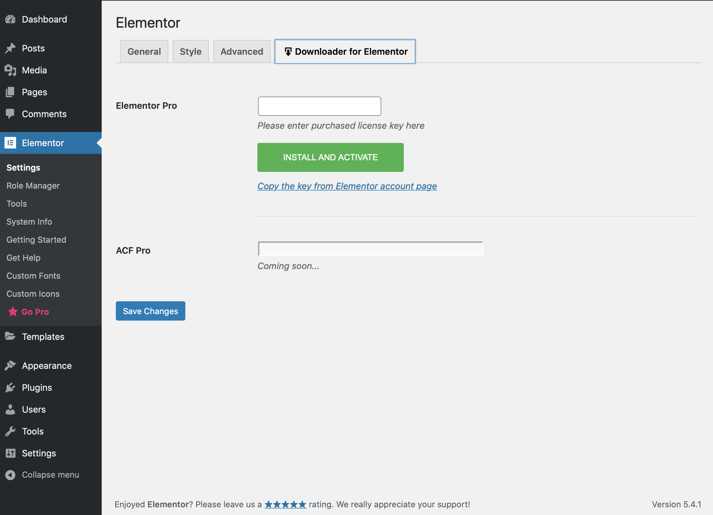

# Downloader for Elementor
- Contributors: CDK Comp, mihdan
- Donate link: https://www.paypal.me/cdkdev
- Tags: elementor, elementor-pro, acf, acf-pro, download, tweaks, wpbro
- Requires at least: 5.0
- Tested up to: 5.4.1
- Stable tag: 1.0.0
- Requires PHP: 5.6.20
- License: GPLv2 or later
- License URI: https://www.gnu.org/licenses/gpl-2.0.html

### Downloader for Elementor

## Description

1. Just activate this plugin.
2. Click on Downloader for Elementor settings.
3. Add license key of Premium product.
4. Click on Install and Activate button
5. Cheers!

>Must-have utility plugin that allows you to install elementor pro plugin directly from WordPress Settings!

Downloader for Elementor helps you save time with premium plugin downloading and installation.
You don't need to download the ZIP files from product account panel, simple put the license in the field and the plugin will be downloaded,
installed and activated via API integration and WordPress Codex Upgrade function.
The plugin does not create any DataBase options, the license key used only in GET parameters once.
It is lightweight, but u can remove the plugin after first using.
We support Elementor Pro downloading, and work on Advanced Custom Fields Pro feature.

## Installation

### Installing from the WordPress control panel

1. Go to the page "Plugins > Add New".
2. Input the name "Downloader for Elementor" in the search field
3. Find the "Downloader for Elementor" plugin in the search result and click on the "Install Now" button, the installation process of plugin will begin.
4. Click "Activate" when the installation is complete.

### Installing with the archive

1. Go to the page "Plugins > Add New" on the WordPress control panel
2. Click on the "Upload Plugin" button, the form to upload the archive will be opened.
3. Select the archive with the plugin and click "Install Now".
4. Click on the "Activate Plugin" button when the installation is complete.

### Manual installation

1. Upload the folder `downloader-for-elementor` to a directory with the plugin, usually it is `/wp-content/plugins/`.
2. Go to the page "Plugins > Add New" on the WordPress control panel
3. Find "Downloader for Elementor" in the plugins list and click "Activate".

## Frequently Asked Questions

= Why downloader better =

If you have purchased Elementor Pro from a vendor site, you may want to install of your new purchase simple and fast.
The plugin save your time on automatic installations via wp-cli, runcloud canvas etc.

= Using License key =
The license input field not connected to any options and using for simple URL redirection via installing process.

= More Premium Downloads =
Open new issue in WordPress support area or github issues

== Screenshots ==

== Changelog ==

= 1.0.0 (28.05.2020) =
* Plugin init
* Elementor Pro downloader
* Advanced custom fields in progress

== Upgrade Notice ==
You should update for better plugin work
